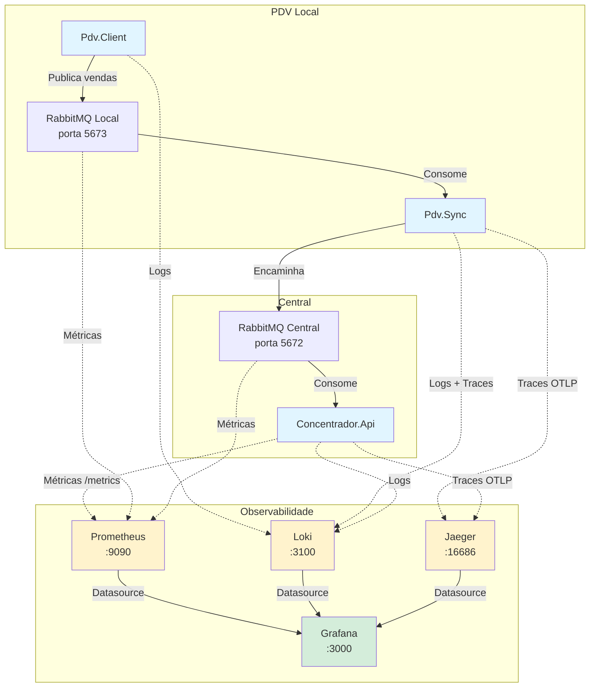
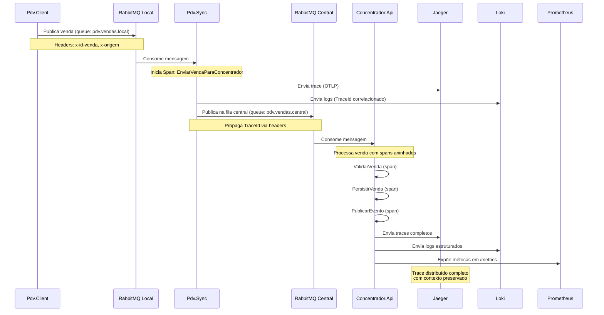

# 🔭 OpenTelemetry Observability Stack

> **Sistema distribuído de vendas com observabilidade completa usando OpenTelemetry, Prometheus, Loki, Jaeger, Serilog, Grafana e RabbitMQ**

[](https://dotnet.microsoft.com/)
[](https://opentelemetry.io/)
[](https://www.rabbitmq.com/)
[](https://grafana.com/)
[](LICENSE)

## 📋 Índice

- [Visão Geral](#-visão-geral)
- [Arquitetura](#-arquitetura)
- [Stack de Observabilidade](#-stack-de-observabilidade)
- [Componentes](#-componentes)
- [Pré-requisitos](#-pré-requisitos)
- [Instalação e Execução](#-instalação-e-execução)
- [Configuração](#-configuração)
- [Monitoramento](#-monitoramento)
- [Fluxo de Dados](#-fluxo-de-dados)
- [Dashboards](#-dashboards)
- [Troubleshooting](#-troubleshooting)
- [Contribuindo](#-contribuindo)

## 🎯 Visão Geral

Este projeto demonstra uma implementação completa de **observabilidade** em um sistema distribuído usando os três pilares fundamentais:

- **📊 Métricas** - Prometheus + OpenTelemetry
- **📝 Logs** - Loki + Serilog
- **🔍 Traces** - Jaeger + OpenTelemetry

O sistema simula um ambiente de **ponto de venda (PDV)** distribuído onde vendas são capturadas localmente, sincronizadas via RabbitMQ e processadas centralmente, com rastreamento completo de ponta a ponta.

### Principais Características

✅ **Distributed Tracing** com propagação de contexto via OpenTelemetry  
✅ **Métricas customizadas** e métricas de runtime (.NET)  
✅ **Logs estruturados** com correlação de TraceId/SpanId  
✅ **Dashboards Grafana** para visualização unificada  
✅ **Message Broker** com RabbitMQ (duplo - local e central)  
✅ **Containerização completa** com Docker Compose  
✅ **Health Checks** e endpoints de observabilidade  

## 🏗️ Arquitetura



### Fluxo de Comunicação



## 🛠️ Stack de Observabilidade

### Métricas (Metrics)

- **Prometheus** - Sistema de monitoramento e banco de dados de séries temporais
- **OpenTelemetry Metrics** - Instrumentação automática e métricas customizadas
- **Métricas Expostas**:
  - ASP.NET Core (requests, duração, status codes)
  - Runtime .NET (GC, threads, exceções)
  - RabbitMQ (mensagens, filas, conexões)
  - Métricas customizadas de negócio

### Logs (Logging)

- **Grafana Loki** - Sistema de agregação de logs
- **Serilog** - Framework de logging estruturado para .NET
- **Enriquecimento**:
  - TraceId e SpanId (correlação com traces)
  - Contexto de aplicação
  - Timestamps precisos
  - Níveis de log configuráveis

### Traces (Tracing)

- **Jaeger** - Distributed tracing backend
- **OpenTelemetry** - API e SDK para instrumentação
- **Propagação de Contexto**:
  - W3C Trace Context
  - Headers customizados
  - Spans hierárquicos
  - Baggage para metadados

### Visualização

- **Grafana** - Plataforma de observabilidade e analytics
  - Dashboards unificados
  - Correlação entre métricas, logs e traces
  - Alertas configuráveis

## 📦 Componentes

### 1. Pdv.Client

**Aplicação console** que simula um PDV (Ponto de Venda) gerando vendas aleatórias.

```csharp
Tecnologias:
- .NET 10.0
- RabbitMQ.Client
- Serilog

Responsabilidades:
- Captura entrada do usuário (valor da venda)
- Publica mensagens na fila RabbitMQ local
- Logging de operações
```

**Queue**: `pdv.vendas.local` (RabbitMQ Local - porta 5673)

### 2. Pdv.Sync

**Serviço de sincronização** que atua como bridge entre RabbitMQ local e central.

```csharp
Tecnologias:
- .NET 10.0
- OpenTelemetry (Traces)
- Serilog (Logs com correlação)
- RabbitMQ.Client

Responsabilidades:
- Consome vendas da fila local
- Cria spans para rastreamento
- Encaminha para fila central
- Preserva contexto de trace
```

**Observabilidade**:
- ✅ Distributed Tracing (OTLP → Jaeger)
- ✅ Structured Logging (Serilog → Loki)
- ✅ Trace/Span correlation

### 3. Concentrador.Api

**API REST** que processa vendas centralizadas com observabilidade completa.

```csharp
Tecnologias:
- ASP.NET Core 10.0
- OpenTelemetry (Metrics + Traces)
- Serilog + Loki sink
- Prometheus Exporter

Endpoints:
- POST /vendas - Processa venda
- GET /health - Health check
- GET /metrics - Métricas Prometheus

Responsabilidades:
- Processar vendas com validação
- Simular persistência
- Expor métricas de negócio
- Distributed tracing completo
```

**Métricas Customizadas**:
- `concentrador_vendas_recebidas_total` - Counter de vendas
- Métricas HTTP automáticas
- Métricas de Runtime .NET

### 4. RabbitMQ (Dual Setup)

**Message Brokers** simulando ambientes local e central.

```yaml
RabbitMQ Local:
- Porta AMQP: 5673
- Management UI: 15673
- Queue: pdv.vendas.local

RabbitMQ Central:
- Porta AMQP: 5672
- Management UI: 15672
- Queue: pdv.vendas.central
```

### 5. Infraestrutura de Observabilidade

| Componente | Porta | Descrição |
|------------|-------|-----------|
| **Prometheus** | 9090 | Métricas e alertas |
| **Loki** | 3100 | Agregação de logs |
| **Jaeger UI** | 16686 | Visualização de traces |
| **Grafana** | 3000 | Dashboards unificados |

## 🔧 Pré-requisitos

- [.NET 10.0 SDK](https://dotnet.microsoft.com/download/dotnet/10.0)
- [Docker](https://www.docker.com/get-started) (versão 20.10+)
- [Docker Compose](https://docs.docker.com/compose/) (versão 2.0+)
- 8GB RAM mínimo recomendado

## 🚀 Instalação e Execução

### 1️⃣ Clone o Repositório

```bash
git clone https://github.com/seu-usuario/OTELPrometheusLokiJaegerSerilogGrafanaRabbitMQ.git
cd OTELPrometheusLokiJaegerSerilogGrafanaRabbitMQ
```

### 2️⃣ Inicie a Infraestrutura

```bash
# Sobe todos os serviços de observabilidade e RabbitMQ
docker-compose up -d

# Verifique se todos os containers estão rodando
docker-compose ps
```

**Serviços disponíveis**:
- ✅ RabbitMQ: http://localhost:15672 (guest/guest)
- ✅ RabbitMQ Local: http://localhost:15673 (guest/guest)
- ✅ Prometheus: http://localhost:9090
- ✅ Jaeger: http://localhost:16686
- ✅ Grafana: http://localhost:3000 (admin/admin)

### 3️⃣ Execute os Componentes .NET

#### Terminal 1 - Pdv.Sync (Bridge)

```bash
cd Pdv.Sync
dotnet run
```

#### Terminal 2 - Concentrador.Api

```bash
cd Concentrador.Api
dotnet run
```

Acesse: http://localhost:5100/health

#### Terminal 3 - Pdv.Client (Gerador de Vendas)

```bash
cd Pdv.Client
dotnet run
```

Digite valores de vendas e pressione Enter. Digite 'q' para sair.

## ⚙️ Configuração

### Variáveis de Ambiente

Crie um arquivo `.env` na raiz do projeto (opcional):

```bash
# RabbitMQ Local
RABBITMQ_LOCAL_HOST=localhost
RABBITMQ_LOCAL_PORT=5673
RABBITMQ_LOCAL_USER=guest
RABBITMQ_LOCAL_PASS=guest

# RabbitMQ Central
RABBITMQ_HOST=localhost
RABBITMQ_PORT=5672
RABBITMQ_USER=guest
RABBITMQ_PASS=guest

# OpenTelemetry
OTLP_ENDPOINT_URL=http://localhost:4317

# Loki
LOKI_URL=http://localhost:3100

# Concentrador API
CONCENTRADOR_API_URL=http://localhost:5100
```

### Configuração do Prometheus

Edite `docker/prometheus/prometheus.yml` para adicionar novos targets:

```yaml
scrape_configs:
  - job_name: "meu-servico"
    static_configs:
      - targets: ["meu-servico:8080"]
        labels:
          app: "meu-servico"
```

### Configuração do Loki

Edite `docker/loki/local-config.yaml` para ajustar retenção:

```yaml
limits_config:
  retention_period: 744h  # 31 dias
```

## 📊 Monitoramento

### Grafana Dashboards

Acesse http://localhost:3000 (admin/admin)

#### 1️⃣ Configurar Datasources

**Prometheus**:
- URL: `http://prometheus:9090`
- Access: Server (default)

**Loki**:
- URL: `http://loki:3100`
- Access: Server (default)

**Jaeger**:
- URL: `http://jaeger:16686`
- Access: Server (default)

#### 2️⃣ Dashboards Sugeridos

**Dashboard de Vendas**:
```promql
# Total de vendas processadas
sum(concentrador_vendas_recebidas_total)

# Taxa de vendas por minuto
rate(concentrador_vendas_recebidas_total[1m])

# Latência de processamento
histogram_quantile(0.95, 
  rate(http_server_request_duration_seconds_bucket[5m])
)
```

**Dashboard RabbitMQ**:
```promql
# Mensagens na fila
rabbitmq_queue_messages{queue="pdv.vendas.central"}

# Taxa de publicação
rate(rabbitmq_queue_messages_published_total[1m])

# Consumidores ativos
rabbitmq_queue_consumers
```

**Dashboard .NET Runtime**:
```promql
# GC Collections
rate(process_runtime_dotnet_gc_collections_count[1m])

# Memória alocada
process_runtime_dotnet_gc_allocations_size_bytes

# Thread Pool
process_runtime_dotnet_thread_pool_threads_count
```

### Jaeger - Distributed Tracing

Acesse http://localhost:16686

**Visualizar trace completo**:
1. Service: `Pdv.Sync`
2. Operation: `EnviarVendaParaConcentrador`
3. Encontre traces com múltiplos spans
4. Veja a propagação de contexto através dos serviços

**Tags importantes**:
- `venda.id` - ID único da venda
- `venda.origem` - Origem do PDV
- `venda.total` - Valor total

### Loki - Log Aggregation

**Queries úteis**:

```logql
# Todos os logs do Pdv.Sync
{job="pdv-sync"}

# Logs de erro
{job="concentrador-api"} |= "Error"

# Logs correlacionados com TraceId
{job="pdv-sync"} | json | TraceId="<trace-id>"

# Vendas processadas
{job="concentrador-api"} |= "ProcessarVenda"
```

## 🔄 Fluxo de Dados

### 1. Captura de Venda

```
Pdv.Client
  └─> Entrada do usuário (valor)
  └─> Cria objeto Venda { IdVenda, Origem, Total }
  └─> Publica em RabbitMQ Local (pdv.vendas.local)
      ├─> Headers: x-id-venda, x-origem
      └─> Body: JSON serializado
```

### 2. Sincronização

```
Pdv.Sync
  └─> Consome de RabbitMQ Local
  └─> Inicia Activity (OpenTelemetry)
      ├─> ActivityKind.Producer
      ├─> Tags: venda.id, venda.origem, venda.total
      └─> TraceId propagado
  └─> Log com TraceId/SpanId correlacionado
  └─> Publica em RabbitMQ Central (pdv.vendas.central)
      ├─> Headers: x-trace-id (opcional)
      └─> Body: Mesma mensagem
  └─> ACK na mensagem local
```

### 3. Processamento Central

```
Concentrador.Api
  └─> Consome de RabbitMQ Central (futuro)
  └─> Endpoint POST /vendas
      └─> Span: ProcessarVenda (Kind.Server)
          ├─> Span filho: ValidarVenda
          ├─> Span filho: PersistirVenda
          └─> Span filho: PublicarEvento
      └─> Incrementa counter de métricas
      └─> Logs estruturados com contexto
      └─> Response 200 OK
```

### 4. Observabilidade

```
Coleta de Dados
  ├─> Prometheus scrape /metrics (5s interval)
  │   └─> Armazena séries temporais
  │
  ├─> Loki recebe logs via HTTP
  │   └─> Indexa por labels (job, level, etc)
  │
  └─> Jaeger recebe traces via OTLP gRPC
      └─> Constrói gráfico de spans

Visualização
  └─> Grafana
      ├─> Query Prometheus (métricas)
      ├─> Query Loki (logs)
      └─> Query Jaeger (traces)
      └─> Correlação via TraceId/Timestamp
```

## 📈 Dashboards

### Dashboard Principal - Overview

```json
{
  "panels": [
    {
      "title": "Taxa de Vendas/min",
      "targets": [
        {
          "expr": "rate(concentrador_vendas_recebidas_total[1m])"
        }
      ]
    },
    {
      "title": "Latência P95",
      "targets": [
        {
          "expr": "histogram_quantile(0.95, rate(http_server_request_duration_seconds_bucket[5m]))"
        }
      ]
    },
    {
      "title": "Mensagens na Fila",
      "targets": [
        {
          "expr": "rabbitmq_queue_messages"
        }
      ]
    },
    {
      "title": "Logs Recentes",
      "targets": [
        {
          "expr": "{job=~\"pdv-sync|concentrador-api\"}"
        }
      ]
    }
  ]
}
```

### Exemplo de Visualização

```
┌─────────────────────────────────────────────────────┐
│ 📊 Vendas Processadas (últimas 24h)                │
│ ━━━━━━━━━━━━━━━━━━━━━━━━━━━━━━━━━━━━━━━━━━━━━━━━━ │
│        ▁▂▃▅▇█▇▅▃▂▁                                 │
│     ▁▂▃▅▇███████▇▅▃▂▁                              │
│  ▁▂▃▅▇█████████████▇▅▃▂▁                           │
│ ━━━━━━━━━━━━━━━━━━━━━━━━━━━━━━━━━━━━━━━━━━━━━━━━━ │
│ Total: 1,247 vendas | Média: 52/hora               │
└─────────────────────────────────────────────────────┘

┌─────────────────────────────────────────────────────┐
│ 🔍 Trace Distribuído                                │
│ ━━━━━━━━━━━━━━━━━━━━━━━━━━━━━━━━━━━━━━━━━━━━━━━━━ │
│ Pdv.Client                                          │
│   └─> [5ms] PublicarVenda                          │
│       └─> Pdv.Sync                                  │
│           └─> [15ms] EnviarVendaParaConcentrador   │
│               └─> Concentrador.Api                  │
│                   └─> [50ms] ProcessarVenda        │
│                       ├─> [10ms] ValidarVenda      │
│                       ├─> [20ms] PersistirVenda    │
│                       └─> [20ms] PublicarEvento    │
│ ━━━━━━━━━━━━━━━━━━━━━━━━━━━━━━━━━━━━━━━━━━━━━━━━━ │
│ Latência Total: 70ms | Spans: 6                    │
└─────────────────────────────────────────────────────┘
```

## 🐛 Troubleshooting

### Problema: Containers não iniciam

```bash
# Verifique logs
docker-compose logs -f

# Reinicie containers específicos
docker-compose restart prometheus
docker-compose restart jaeger
```

### Problema: Métricas não aparecem no Prometheus

1. Verifique se o endpoint está acessível:
```bash
curl http://localhost:5100/metrics
```

2. Verifique targets no Prometheus:
http://localhost:9090/targets

3. Verifique configuração do `prometheus.yml`

### Problema: Traces não aparecem no Jaeger

1. Verifique se OTLP está configurado corretamente:
```bash
# Porta OTLP gRPC
telnet localhost 4317
```

2. Verifique logs da aplicação:
```bash
dotnet run
# Procure por erros de exportação OTLP
```

3. Verifique variável de ambiente:
```bash
echo $OTLP_ENDPOINT_URL
```

### Problema: Logs não aparecem no Loki

1. Teste conectividade:
```bash
curl http://localhost:3100/ready
```

2. Verifique configuração do Serilog:
```csharp
.WriteTo.GrafanaLoki("http://localhost:3100")
```

3. Consulte logs diretamente:
```bash
curl -G -s "http://localhost:3100/loki/api/v1/query" \
  --data-urlencode 'query={job="pdv-sync"}'
```

### Problema: RabbitMQ não conecta

1. Verifique se está rodando:
```bash
docker ps | grep rabbitmq
```

2. Teste conexão:
```bash
telnet localhost 5672  # Central
telnet localhost 5673  # Local
```

3. Verifique credenciais e variáveis de ambiente

## 🎓 Conceitos Importantes

### OpenTelemetry Spans

```csharp
// Span raiz (Kind.Server - recebe request)
using var activity = activitySource.StartActivity("ProcessarVenda", ActivityKind.Server);

// Span filho (Kind.Internal - operação interna)
using (activitySource.StartActivity("ValidarVenda", ActivityKind.Internal))
{
    // validação
}

// Span produtor (Kind.Producer - envia mensagem)
using (activitySource.StartActivity("PublicarEvento", ActivityKind.Producer))
{
    // publish RabbitMQ
}

// Span consumidor (Kind.Consumer - consome mensagem)
using var activity = activitySource.StartActivity("ProcessarMensagem", ActivityKind.Consumer);
```

### Correlação Logs + Traces

```csharp
// Serilog com enriquecimento de Span
.Enrich.WithSpan()  // Adiciona TraceId e SpanId

// Log automático inclui:
{
  "Message": "Venda processada",
  "TraceId": "4bf92f3577b34da6a3ce929d0e0e4736",
  "SpanId": "00f067aa0ba902b7",
  "VendaId": "123e4567-e89b-12d3-a456-426614174000"
}
```

### Métricas vs Traces vs Logs

| Aspecto | Métricas | Logs | Traces |
|---------|----------|------|--------|
| **Quando usar** | Agregações numéricas | Eventos discretos | Fluxo de request |
| **Cardinalidade** | Baixa | Alta | Média |
| **Exemplo** | Taxa de erro | "Erro ao salvar" | Latência end-to-end |
| **Custo** | Baixo | Médio-Alto | Médio |
| **Retenção** | Longa (meses) | Curta (dias) | Curta (dias) |

## 📚 Recursos Adicionais

- [OpenTelemetry Documentation](https://opentelemetry.io/docs/)
- [Prometheus Best Practices](https://prometheus.io/docs/practices/)
- [Jaeger Architecture](https://www.jaegertracing.io/docs/latest/architecture/)
- [Grafana Loki](https://grafana.com/docs/loki/latest/)
- [Serilog Wiki](https://github.com/serilog/serilog/wiki)
- [RabbitMQ Tutorials](https://www.rabbitmq.com/tutorials)

## 🤝 Contribuindo

Contribuições são bem-vindas! Por favor:

1. Fork o projeto
2. Crie uma branch para sua feature (`git checkout -b feature/AmazingFeature`)
3. Commit suas mudanças (`git commit -m 'Add some AmazingFeature'`)
4. Push para a branch (`git push origin feature/AmazingFeature`)
5. Abra um Pull Request

## 📝 License

Este projeto está sob a licença MIT. Veja o arquivo [LICENSE](LICENSE) para mais detalhes.

## 👨‍💻 Autor

**Lyncoln Mauricio**

- GitHub: [@lyncolnmauricio](https://github.com/lyncolnmauricio)

---

⭐ Se este projeto foi útil para você, considere dar uma estrela!

**Feito com ❤️ e .NET 10.0**

